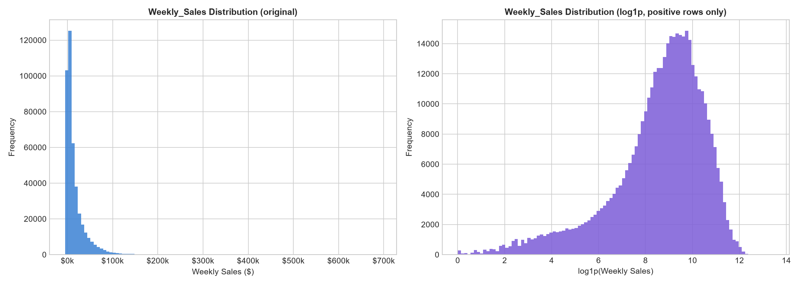
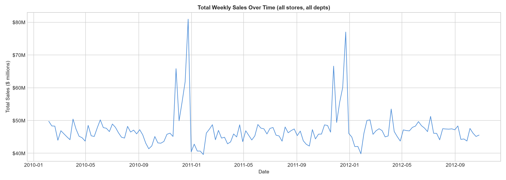
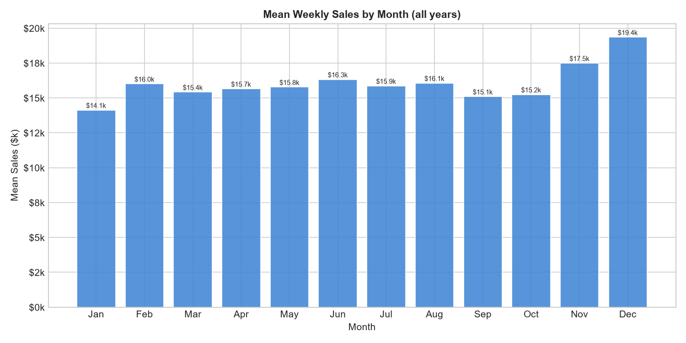
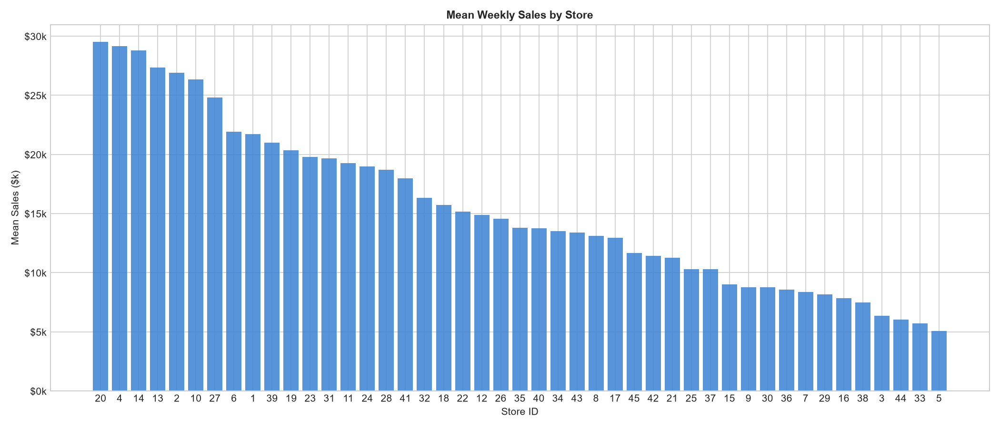
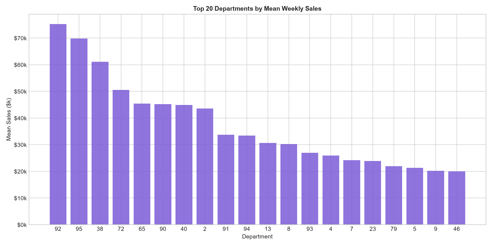
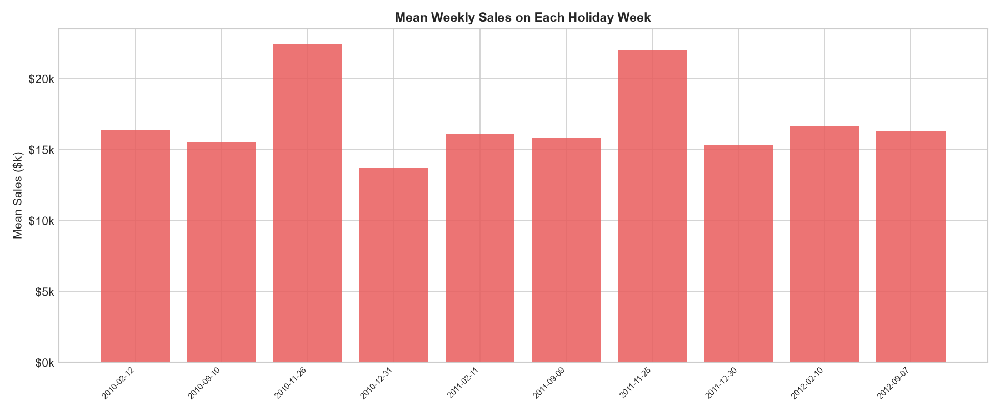
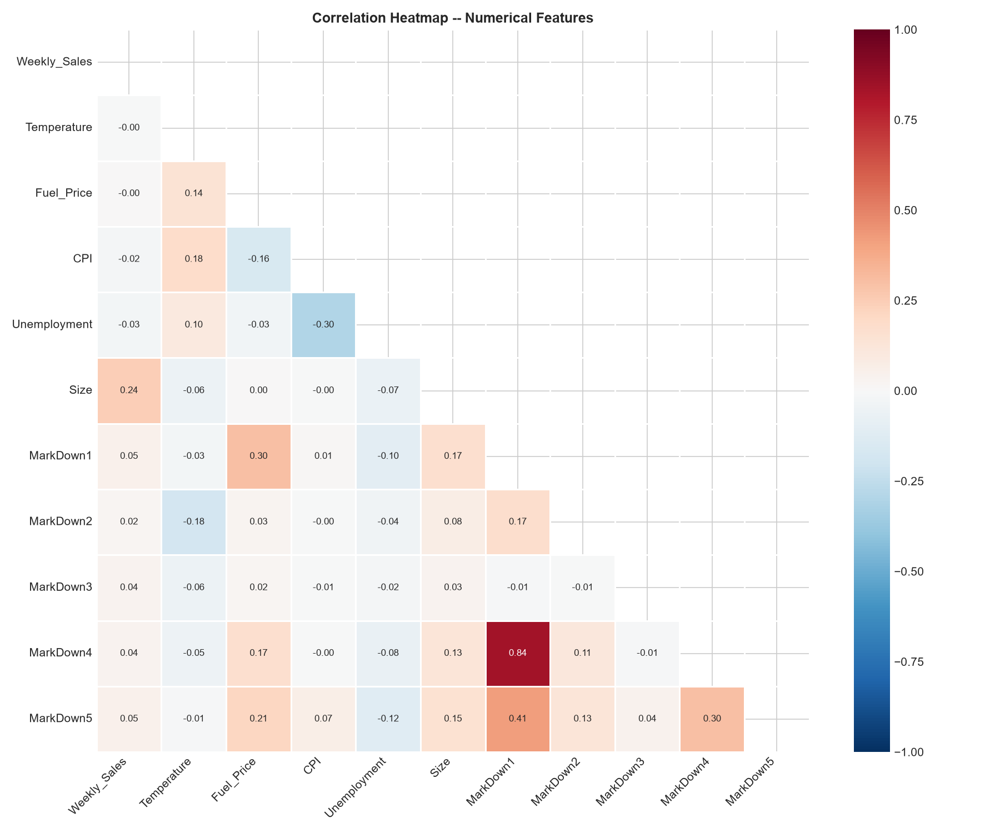

# Walmart Sales Prediction

A complete end-to-end Data Analytics and Machine Learning project that forecasts weekly sales for Walmart stores and departments using historical transactional and contextual data.

---

## Project Overview

This project builds a reproducible sales forecasting pipeline for Walmart's 45 stores and 81 departments. Starting from raw CSV data, it progresses through data understanding, cleaning, preparation, exploratory analysis, feature engineering, chronological model validation, and a production-ready Streamlit application.

The final model predicts **Weekly Sales** for every Store/Department/Week combination in the test period (November 2012 – July 2013).

---

## Business Problem

Accurate weekly sales forecasting is operationally critical for a large-scale retailer like Walmart. Reliable predictions support:

- **Inventory planning** — stock the right quantities before demand peaks
- **Staffing decisions** — align labour with expected customer volume
- **Promotion planning** — time MarkDown events for maximum impact
- **Store-level planning** — allocate resources proportionally across locations
- **Seasonal planning** — prepare well in advance for Thanksgiving and Christmas spikes

The Kaggle competition that motivates this project uses **Weighted Mean Absolute Error (WMAE)** as its evaluation metric, assigning 5× weight to holiday weeks, reflecting their outsized business importance.

---

## Dataset

Four CSV files are provided by the [Kaggle Walmart Recruiting Store Sales Forecasting](https://www.kaggle.com/datasets/gustavoserafim/walmart-recruiting-store-sales-forecasting-gsr):

| File | Rows | Description |
|------|------|-------------|
| `train.csv` | 421,570 | Historical weekly sales per Store/Department (2010-02-05 – 2012-10-26) |
| `test.csv` | 115,064 | Future weeks to predict (2012-11-02 – 2013-07-26) — no target values |
| `features.csv` | 8,190 | Weekly store-level features: Temperature, Fuel Price, MarkDowns, CPI, Unemployment |
| `stores.csv` | 45 | Store metadata: Type (A/B/C) and Size (sq ft) |

> **Note:** `test.csv` does not contain actual Weekly_Sales values. All predictions in this project are model outputs, not confirmed future outcomes.

---

## Technologies Used

| Technology | Purpose |
|-----------|---------|
| Python 3.10+ | Core language |
| Pandas | Data manipulation and merging |
| NumPy | Numerical computation |
| Matplotlib / Seaborn | Visualisation |
| Scikit-learn | Machine learning models and metrics |
| Streamlit | Interactive prediction web application |
| Jupyter Notebook | Project documentation and reproducibility |
| python-docx | Automated report generation |

---

## Project Workflow

| Stage | Description |
|-------|-------------|
| 1 | Data Understanding & Profiling |
| 2 | Data Cleaning |
| 3 | Data Preparation |
| 4 | Exploratory Data Analysis |
| 5 | Feature Engineering |
| 6 | Model Training & Chronological Validation |
| 7 | Streamlit Application |
| 8 | Final Model, Test Predictions & Business Insights |
| 9 | Final Packaging (Notebook, README, Report) |

---
## Exploratory Data Analysis

### Weekly Sales Distribution



### Weekly Sales Trend



### Monthly Sales Seasonality



### Store Mean Sales



### Department Mean Sales



### Holiday Week Sales



### External Feature Distributions


### Correlation Heatmap



## Machine Learning Approach

### Validation Strategy
- **No random train/test splitting** — all splits are strictly chronological
- **Walk-forward 3-fold CV** (expanding window):
  - Fold 1: train ≤ 2011-10-21 | val 2011-10-28 – 2012-02-03
  - Fold 2: train ≤ 2012-01-27 | val 2012-02-03 – 2012-05-04
  - Fold 3: train ≤ 2012-04-27 | val 2012-05-04 – 2012-10-26
- **Primary hold-out**: train ≤ 2012-07-27 | val 2012-08-03 – 2012-10-26

### Evaluation Metric
**WMAE** = Σ(w × |actual − predicted|) / Σ(w)
- w = 5 for holiday weeks, w = 1 otherwise

### Approved Stage-1 Feature Set (25 features)
`Store`, `Dept`, `Year`, `Month`, `Week`, `Quarter`, `Type`, `IsHoliday_int`, `Is_Known_Holiday`, `Temperature`, `Fuel_Price`, `MarkDown1`–`MarkDown5`, `MarkDown1_active`–`MarkDown5_active`, `CPI`, `Unemployment`, `Size`, `lag_52`

- `lag_52` (same-week sales from 52 weeks prior) is the only lag feature used — it is always sourced from training history and carries no leakage risk
- `lag_1`, `lag_2`, `lag_4`, and all rolling features were intentionally excluded from the Stage-1 model

### Models Compared

| Model | Avg CV WMAE | Primary WMAE |
|-------|------------|-------------|
| **Lag-52 Baseline** ✅ | **2,278.13** | 1,893.62 |
| Random Forest | 2,534.20 | 1,561.32 |
| HistGradientBoosting | 2,779.30 | 1,689.01 |

### Selected Model
**Lag-52 Baseline** — selected on lowest average cross-validated WMAE (2,278.13).
The baseline is immune to the cold-start effect (Fold 1 predates MarkDown history) that significantly penalised the tree-based models in early folds.

---

## Results

| Metric | Value |
|--------|-------|
| Average CV WMAE | 2,278.13 |
| Primary Hold-out WMAE | 1,893.62 |
| Primary Hold-out MAE | 1,867.98 |
| Primary Hold-out RMSE | 3,936.34 |
| Test rows predicted | 115,064 |

---

## Streamlit Application

`app.py` provides an interactive prediction interface:

- Select Store, Department, and Week Date
- Enter economic and promotional inputs
- Click **Predict Weekly Sales**
- View predicted sales with explanation of the lag-52 source

To launch:
```bash
streamlit run app.py
```

---

## Project Structure

```
Walmart-Sales-Prediction/
│
├── Walmart_Sales_Prediction.ipynb   ← Main project notebook
├── app.py                           ← Streamlit application
├── requirements.txt
├── README.md
│
├── train.csv                        ← Original (never modified)
├── test.csv                         ← Original (never modified)
├── features.csv                     ← Original (never modified)
├── stores.csv                       ← Original (never modified)
│
├── train_cleaned.csv
├── test_cleaned.csv
├── train_prepared.csv
├── test_prepared.csv
├── train_features.csv
├── test_features.csv
│
├── data_cleaning.py
├── data_preparation.py
├── feature_engineering.py
├── eda.py
├── model_training.py
│
├── eda_plots/                       ← 19 EDA visualisations
│   ├── 01_target_distribution.png
│   └── ...
│
└── model_outputs/
    ├── final_model.pkl
    ├── final_model_meta.pkl
    ├── selected_model.pkl
    ├── model_meta.pkl
    ├── model_validation_results.csv
    ├── walmart_sales_predictions.csv
    ├── store_prediction_summary.csv
    ├── department_prediction_summary.csv
    └── business_insights.md
```

---

## How to Run

### 1. Install dependencies
```bash
pip install -r requirements.txt
```

### 2. Launch the Streamlit application
```bash
streamlit run app.py
```

### 3. Open the Jupyter Notebook
```bash
jupyter notebook Walmart_Sales_Prediction.ipynb
```

---

## Important Data Note

The original `test.csv` file does not contain actual future Weekly_Sales values (consistent with the Kaggle competition format). All predictions in `model_outputs/walmart_sales_predictions.csv` are **model estimates**, not confirmed sales outcomes.

---

## Author

**Gouthami Mandapelli**
